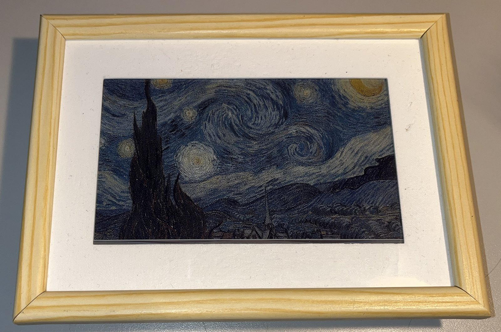
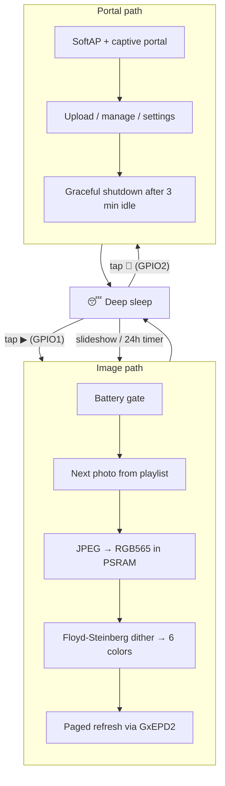
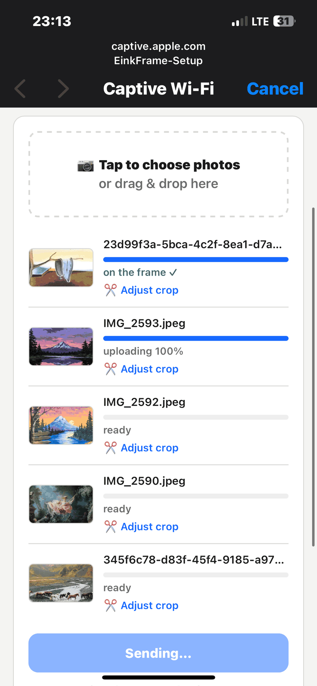
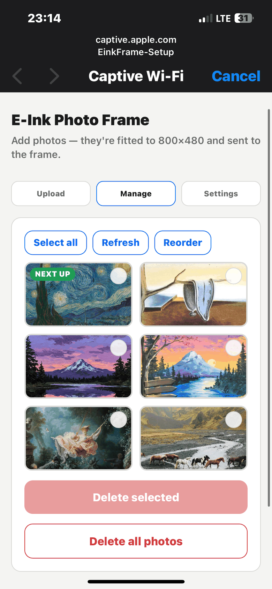
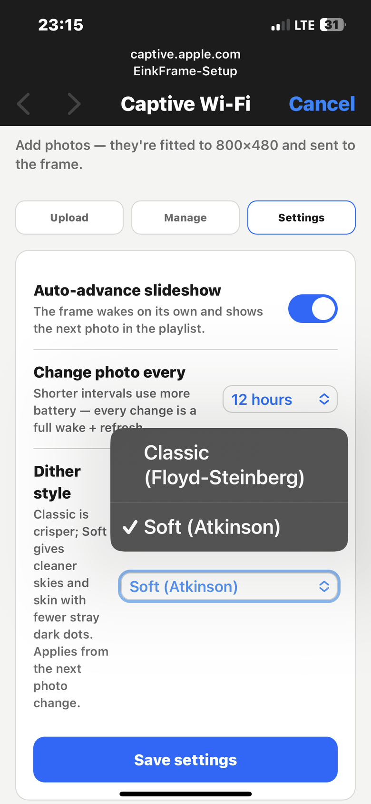

# 🖼️ E-Ink Photo Frame

[](https://github.com/noamleykin-debug/E-ink-code-design-/actions/workflows/build.yml)
[](LICENSE)
[](https://www.espressif.com/en/products/socs/esp32-s3)

**A battery-powered, 6-color e-paper photo frame you control from your phone: no app, no cloud, no account.**

Built around an ESP32-S3 and a 7.3" Spectra 6 e-paper panel. Tap the frame and it wakes from deep sleep, paints the next photo, and goes back to sleep, sipping essentially zero power while the picture stays on the screen indefinitely.

<p align="center">
  
</p>

> 📷 *Photos of the build live in [`docs/images/`](docs/images/), see the [gallery](#gallery) below.*

---

## Highlights

- **Weeks-to-months on one charge.** The ESP32-S3 deep-sleeps between photos, and e-paper holds the image with zero power.
- **Phone-first workflow.** Tap the frame's Wi-Fi button, join its hotspot, and a captive portal pops up automatically (iOS, Android, Windows). No app install.
- **In-browser crop editor.** Drag and zoom each photo inside a fixed 5:3 window; the browser produces an exact 800×480 JPEG so the firmware never guesses.
- **Full playlist control.** Reorder photos, delete them, jump to any photo, and see which one is "next up".
- **Slideshow mode.** Optional auto-advance at a user-chosen interval (5 min to 24 h), enforced in firmware to protect the panel and battery.
- **6-color dithering on-device.** Serpentine error diffusion quantizes full-color JPEGs to the panel's black/white/red/green/blue/yellow palette, with two selectable styles: classic Floyd-Steinberg or the softer Atkinson.
- **Crash-safe storage.** Playlist and settings are written atomically (temp file + rename), and the filesystem is never auto-formatted, so a transient mount error can't wipe the gallery.

## Hardware

| Part | Role |
|------|------|
| ESP32-S3-DevKitC-1 (16 MB flash, 8 MB OPI PSRAM) | Brains; PSRAM holds the full decoded frame |
| Good Display GDEP073E01 7.3" (E6 / Spectra 6) | 800×480, 6-color e-paper panel |
| DESPI-C73 adapter | Panel drive electronics, SPI interface |
| 2× capacitive touch pads | GPIO1 = next photo · GPIO2 = start Wi-Fi portal |
| LiPo battery + buck-boost converter | Untethered power |
| Voltage divider on GPIO6 *(planned)* | Battery gauge / low-battery cutoff |

The full pin map and every tunable constant live in a single source of truth: [`include/config.h`](include/config.h).

## How it works

The firmware is a finite-state machine that lives almost entirely in deep sleep. Each wake does exactly one job, then sleeps again:



Two hard rules shape the whole design:

1. **Wi-Fi and rendering never run in the same wake.** The web server and the decode/dither/refresh pipeline both need large amounts of heap and PSRAM, and on battery their combined current draw risks a brownout. The portal hands off to the render path by scheduling a clean reboot.
2. **The e-paper panel is treated gently.** One full refresh per wake, a 30 s lockout against rapid re-taps, a mandatory refresh every 24 h for panel health, and `hibernate()` whenever idle.

### The rendering pipeline

The phone uploads photos already sized to the panel's native 800×480, so the firmware's job is color, not geometry:

1. **Decode.** TJpg_Decoder streams the JPEG from LittleFS into a 750 KB RGB565 buffer in PSRAM (the ESP32-S3's internal RAM couldn't hold a tenth of it).
2. **Dither.** Each pixel is quantized to the nearest of the 6 panel colors, and the quantization error diffuses to neighbors (Floyd-Steinberg, 7/16 · 3/16 · 5/16 · 1/16). Rows alternate direction (*serpentine scanning*) to prevent the diagonal "worm" artifacts that plain raster scanning produces with such a small palette. Output is a packed 4-bits-per-pixel index buffer.
3. **Paint.** GxEPD2 drives the panel in pages (~32 KB of internal RAM at a time) while the full frame stays in PSRAM.

### The captive portal

Waking with the Wi-Fi pad starts an open access point with wildcard DNS and the OS-detection probe routes (`/generate_204`, `/hotspot-detect.html`, `/connecttest.txt`), so phones auto-open the interface the moment they join. The single-page app (vanilla JS, zero dependencies, fully inlined because the portal has no internet) offers three tabs:

| Upload | Manage | Settings |
|--------|--------|----------|
|  |  |  |
| Pick photos, adjust each crop, watch per-file progress | Thumbnails, multi-select delete, reorder, "show this one" | Slideshow on/off + interval, and the dither style |

Everything heavy happens in the browser: cropping, downscaling to 800×480, JPEG encoding. The ESP only ever receives display-ready files. Thumbnails load two at a time with client-side caching, since a browser's default six-plus parallel connections would starve the little SoC's flash filesystem.

A JSON API backs it all: `/api/upload`, `/api/list`, `/api/reorder`, `/api/delete`, `/api/show`, `/api/settings`, `/api/ping`.

### Power design

- Wake sources: EXT1 on the two touch pads plus an RTC timer (slideshow interval or the 24 h mandatory refresh).
- Cross-sleep timekeeping uses the RTC domain (`gettimeofday` + `RTC_DATA_ATTR` variables), because `millis()` dies with every deep sleep.
- The battery ADC pin is isolated (`rtc_gpio_isolate`) before sleep so the sense divider can't leak.
- A low-battery gate (`BATT_MONITOR_ENABLED`) refuses to refresh below cutoff and hibernates the panel. It gets armed once the battery sense line is wired.

## Project structure

```
include/config.h        Single source of truth: pins, palette, timing, buffers
include/*.h             Module interfaces
src/main.cpp            Wake-cause dispatch (the FSM)
src/power.cpp           Wake causes, battery ADC, deep sleep entry
src/storage.cpp         LittleFS, playlist + settings (atomic JSON writes)
src/decode.cpp          JPEG to RGB565 (TJpg_Decoder)
src/dither.cpp          Serpentine Floyd-Steinberg, 6-color quantization
src/display.cpp         GxEPD2 paged rendering
src/webportal.cpp       SoftAP, captive portal, upload/manage/settings API
data/www/index.html     The entire web app (single file, no dependencies)
docs/                   Architecture, API reference, hardware, AI workflow
```

## Documentation

| Doc | Contents |
|---|---|
| [`docs/ARCHITECTURE.md`](docs/ARCHITECTURE.md) | System design: wake FSM, rendering pipeline, persistence, panel discipline |
| [`docs/API.md`](docs/API.md) | The captive portal's HTTP/JSON API |
| [`docs/DEVELOPMENT.md`](docs/DEVELOPMENT.md) | Building, branching, PR rules, definition of done |
| [`docs/hardware/`](docs/hardware/) | Electronics and enclosure (in progress) |
| [`docs/ai/`](docs/ai/) | How the AI-assisted development workflow was organized |

## Building & flashing

Requires [PlatformIO](https://platformio.org/).

```bash
pio run                 # compile
pio run -t upload       # flash firmware (USB)
pio run -t uploadfs     # upload the web app to LittleFS
pio device monitor      # serial console @ 115200
```

CI compiles every pull request (see [`.github/workflows`](.github/workflows)).

## Using it

1. **Add photos.** Hold the 📶 pad, join the `EinkFrame-Setup` Wi-Fi from your phone, and the portal opens itself. Upload, crop, done.
2. **Next photo.** Tap the ▶ pad.
3. **Slideshow.** Enable it in the portal's Settings tab and pick an interval.
4. The portal shuts down after 3 idle minutes (or immediately after "show on frame") and the frame goes back to sleep.

**What photos look best?** Bold, saturated, well-lit images. The panel mixes every color from just six inks, so pastel gradients turn grainy while poster-style shots look fantastic. Push saturation a little past tasteful before uploading; the dithering mutes it back down.

## Gallery

Up close, the six inks give themselves away. Every shade of blue in that sky is a
woven pattern of black, white, blue and yellow dots — the panel has no greys, no
gradients and no intermediate tones, so the illusion is built entirely out of
error diffusion. Step back a foot and it reads as a painting again.

<p align="center">
  
</p>

## Credits

- **Firmware & web app**: [Noam Leykin](https://github.com/noamleykin-debug), built with AI coding agents working under human direction. The workflow itself is documented in [`docs/ai/`](docs/ai/).
- **Enclosure design & 3D printing**: **Noam Shmazion**, who turned rough requirements into a clean, print-ready design and did an excellent job of it.

## License

Released under the [PolyForm Noncommercial License 1.0.0](LICENSE).

**In plain English:** use it, modify it, build one, share your changes, write
about it, teach with it. Personal projects, hobby builds, study, research,
schools, nonprofits and public institutions are all covered.

**What is not granted:** commercial use. You may not sell this firmware, ship it
inside a product, or run it as part of a paid service without a separate
license. If a company wants to do any of that, please
[get in touch](https://github.com/noamleykin-debug) first.

Third-party libraries the build pulls in (GxEPD2, Adafruit GFX, TJpg_Decoder,
ESPAsyncWebServer, ArduinoJson, and the ESP32 Arduino core) keep their own
licenses; this repository's terms cover only the code written for this project.
